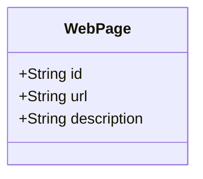

## About
Repositório criado para envio de desafio de RestfulAPI, para o Bootcamp Santander de Java na DIO.

 

## Tecnologias e Ferramentas
- Java 17
- Spring Boot
- Swagger
- H2
- PostgreSQL
- Railway
- IntelliJ

 

## Diagrama de Classes

 

## Swagger

 

## 

Made with ❤️ by Giselle Ferreira.

  

    
  

